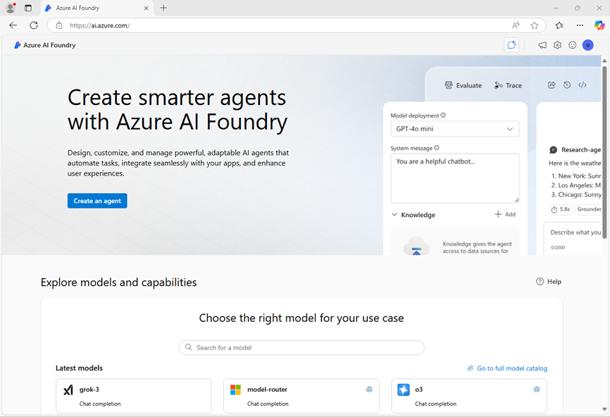
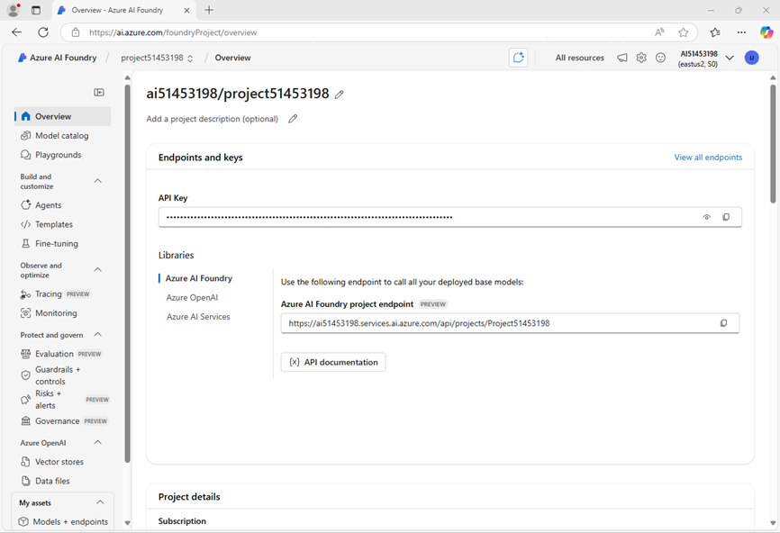

---
lab:
    title: 'Apply filters on functions'
    description: 'Learn how to apply filters on functions with Semantic Kernel.'
---

# Apply filters on functions

In this exercise, you consume a previous chat conversation between the user and the assistant to generate a new response. To do this, you need to apply a trust filter on the function result. Let's get started!

This exercise takes approximately **10** minutes to complete.

## Deploy a chat completion model

1. In a web browser, open the [Azure AI Foundry portal](https://ai.azure.com) at `https://ai.azure.com` and sign in using your Azure credentials. Close any tips or quick start panes that are opened the first time you sign in, and if necessary use the **Azure AI Foundry** logo at the top left to navigate to the home page, which looks similar to the following image (close the **Help** pane if it's open):

    

1. In the home page, in the **Explore models and capabilities** section, search for the `gpt-4o` model; which we'll use in our project.
1. In the search results, select the **gpt-4o** model to see its details, and then at the top of the page for the model, select **Use this model**.
1. When prompted to create a project, enter a valid name for your project and expand **Advanced options**.
1. Select **Customize** and specify the following settings for your hub:
    - **Azure AI Foundry resource**: *A valid name for your Azure AI Foundry resource*
    - **Subscription**: *Your Azure subscription*
    - **Resource group**: *Create or select a resource group*
    - **Region**: *Select any **AI Services supported location***\*

    > \* Some Azure AI resources are constrained by regional model quotas. In the event of a quota limit being exceeded later in the exercise, there's a possibility you may need to create another resource in a different region.

1. Select **Create** and wait for your project, including the gpt-4o model deployment you selected, to be created.
1. When your project is created, the chat playground will be opened automatically.
1. In the navigation pane on the left, select **Overview** to see the main page for your project; which looks like this:

    > **Note**: If an *Insufficient permissions** error is displayed, use the **Fix me** button to resolve it.

    

1. Under the **Libraries** section of the overview page, select **Azure OpenAI**

    You'll use the data here in the next task to build your kernel. Remember to keep your keys private and secure!

## Create an AI client app

Now you're ready to create a Semantic Kernel client app that provides different functions filters. Some code is provided for you in a GitHub repository.

### Prepare the environment

1. Open a new browser tab (keeping the Azure AI Foundry portal open in the existing tab). Then in the new tab, browse to the [Azure portal](https://portal.azure.com) at `https://portal.azure.com`; signing in with your Azure credentials if prompted.

    Close any welcome notifications to see the Azure portal home page.

1. Use the **[\>_]** button to the right of the search bar at the top of the page to create a new Cloud Shell in the Azure portal, selecting a ***PowerShell*** environment with no storage in your subscription.

    The cloud shell provides a command-line interface in a pane at the bottom of the Azure portal. You can resize or maximize this pane to make it easier to work in.

    > **Note**: If you have previously created a cloud shell that uses a *Bash* environment, switch it to ***PowerShell***.

1. In the cloud shell toolbar, in the **Settings** menu, select **Go to Classic version** (this is required to use the code editor).

    **<font color="red">Ensure you've switched to the classic version of the cloud shell before continuing.</font>**

1. In the cloud shell pane, enter the following commands to clone the GitHub repo containing the code files for this exercise (type the command, or copy it to the clipboard and then right-click in the command line and paste as plain text):

    ```
    rm -r mslearn-ai-semantic-kernel -f
    git clone https://github.com/MicrosoftLearning/mslearn-ai-semantic-kernel mslearn-ai-semantic-kernel
    ```

    > **Tip**: As you paste commands into the cloudshell, the output may take up a large amount of the screen buffer. You can clear the screen by entering the `cls` command to make it easier to focus on each task.

1. After the repo has been cloned, navigate to the folder containing the application code files:  

    > **Note**: Follow the steps for your chosen programming language.

    **Python**

    ```
    cd mslearn-ai-semantic-kernel/Labfiles/04-apply-function-filters/Python
    ```

    **C#**

    ```
    cd mslearn-ai-semantic-kernel/Labfiles/04-apply-function-filters/C-sharp
    ```

1. In the cloud shell command line pane, enter the following command to install the libraries you'll use:

    **Python**

    ```
    python -m venv labenv
    ./labenv/bin/Activate.ps1
    pip install python-dotenv semantic-kernel[azure]
    ```

    **C#**

    ```
    dotnet add package Microsoft.SemanticKernel
    ```

1. Enter the following command to edit the configuration file that has been provided:

    **Python**

    ```
    code .env
    ```

    **C#**

    ```
    code appsettings.json
    ```

    The file should open in a code editor.

1. In the code file, replace the **your_project_endpoint** and **your_project_api_key** placeholders with the Azure OpenAI endpoint and API key for your project (copied from the project **Overview** page in the Azure AI Foundry portal), and replace the **your_deployment_name** placeholder with the name you assigned to your gpt-4o model.

1. After you replace the placeholders, in the code editor, use the **CTRL+S** command or **Right-click > Save** to save your changes and then use the **CTRL+Q** command or **Right-click > Quit** to close the code editor while keeping the cloud shell command line open.

### Request user approval for an operation

In this task, you add a filter function that will request the user's approval before allowing the assistant to book a flight on their behalf. Let's get started!

1. Enter the following command to edit the permission filter file that has been provided:

    **Python**
    ```
    code filters.py
    ```

    **C#**
    ```
    code Program.cs
    ```

1. Update the class definition under the comment **Create the function filer class**:

    **Python**
    ```python
    # Create the function filer class
    async def permission_filter(context: FunctionInvocationContext, 
        next: Callable[[FunctionInvocationContext], Awaitable[None]]) -> None:
    ```

    **C#**
    ```c#
    // Create the function filer class
    public class PermissionFilter : IFunctionInvocationFilter
    ```

1. Add the following code under the comment **Implement the function invocation method**

    **Python**
    ```python
    # Implement the function invocation method
    if not has_user_permission(context.function.plugin_name, context.function.name):
        context.result = "The operation was not approved by the user"
        return
    
    await next(context)
    ```

    **C#**
    ```c#
    // Implement the function invocation method
    public async Task OnFunctionInvocationAsync(FunctionInvocationContext context, Func<FunctionInvocationContext, Task> next)
    {
        if (!HasUserPermission(context.Function.PluginName, context.Function.Name))
        {
            context.Result = new FunctionResult(context.Result, "The operation was not approved by the user");
            return;
        }
        
        await next(context);
    }
    ```

1. Add the following code under the comment **Add the permission filter to the kernel**:

    **Python**
    ```python
    # Add the permission filter to the kernel
    kernel.add_filter('function_invocation', permission_filter)
    ```

    **C#**
    ```c#
    // Add the permission filter to the kernel
    kernel.FunctionInvocationFilters.Add(new PermissionFilter());
    ```

1. In the terminal to test your new filter.

    **Python**
    ```python
    # Enter the command
    python filters.py
    ```

    **C#**
    ```
    // Enter the command
    dotnet run
    ```

    Try denying the approval request. You should see a response similar to the following output:

    ```output
    User: Find me a flight to Tokyo on January 19
    Assistant: I found a flight to Tokyo on the 19th of January. The flight is with Air Japan and the price is $1200.
    User: Can you book this flight for me?
    System Message: The agent requires an approval to complete this operation. Do you approve (Y/N)
    User: N
    Assistant: I'm sorry, but I am unable to book the flight for you.
    ```

Now you successfully added a function filter service to your kernel. Great work!
